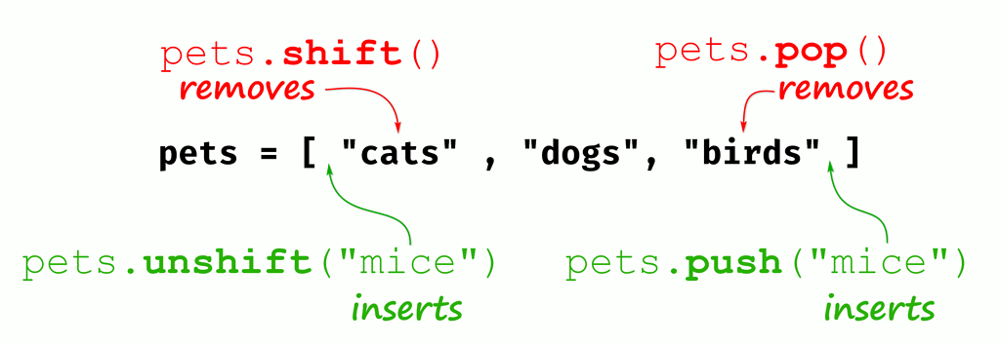

## 1-Getting Started

1. Strl+shift+J : open Chrome javascript console.
   1. try `alert("Hello, world!");` in the console
   2. JavaScript can run in the html file

```html
<html>
  <body>
    <script>
      alert("Hello from hello.html!");
    </script>
  </body>
</html>
```

## 2-The Basic

1. Expressions, have values, but don't let computer do anything
1. statements, tells computer to perform tasks, but don't have values
1. JavaScript statements end with a semicolon.
1. Compound expression,
1. literal,
1. var, let(preferred): two keywords for declaring variables.
   1. `let cats = 2;` `const PI = 3.141592653589793;`
1. naming convention: both **camelCase** and **snake_case** are ok.
1. Strings: `let greeting = 'hello';`
   1. `"abc".length; ` =3
   2. `greeting[0]` = 'h' , `greeting[10]` is `undefined   `
   3. String operation: getting multiple characters from a string
   4. Trimming whitespace from a string
   5. `.toLowerCase() `, `.includes(sss)`, `.padStart(num, char)`, `.repeat(count)`.
   6. Template Literals:
   ```js
   let name = "Nick";
   `Hello, ${name}!`;
   ("Hello, Nick!");
   ```
1. In JavaScript, the values **undefined** and **null** have a same special meaning: they represent nothing.
1. Boolean:
   1. `true && true` is true
   2. `false || true ` is true
   3. `5===5` is true, `"hello" === "goodbye"`is false. the === or “triple equals” operator checks if two values are equal.
   4. `8!==8` is false. This operator checks if two values are not equal.
1. Type Coercion:
   1. `"Current score: " + 10; -->> "Current score: 10" `
   2. `100 + true;  -->> 101`
   3. double equals (==), that applies coercion to its operands before checking for equality. `"1" == 1;-> true `, `
undefined == null; ->true`, `
undefined == false; ->false`,`"" == 0; ->true`,`
"" == false; ->true`
   4. `0 !== false; ->true`; ` 0 != false;->false` Without coercion, 0 is not equal to false, so 0 !== false is true. With coercion, however, false becomes 0, so 0 != false is false.
   5. Use of Truthiness: `let name;
name = name || "No name provided";`, used to give a variable a default value if one isn't provided.

## 3-Compound Data Types

### 1. Arrays:

1. they have the flexibility to grow and shrink as values are added or removed.
2. `let primes = [2, 3, 5, 7, 11, 13, 17, 19];`
3. These multidimensional arrays are often used to represent two-dimensional grids of points, or tables. `
let ticTacToe = [
  ["", "", ""],
  ["", "", ""],
  ["", "", ""]
];` --> (3)[Array(3), Array(3), Array(3)]
4. Adding an Element to an array: `let languages = [];
languages.push("Python");` also the .push() method returns num of elements in the array.
5. To add an element to the beginning of the array rather than the end : `languages.unshift("Erlang");`
6. To mutate an array by removing its last element: `languages.pop();` The method returns the value of the element being removed.
7. To remove the first element from an array, rather than the last: `let worstLanguage = languages.shift();`, Like pop, the shift method returns the removed element.
   
8. Combining arrays: `let fish = ["Salmon", "Cod", "Trout"];
let mammals = ["Sheep", "Cat", "Tiger"];
let animals = fish.concat(mammals); let animals2  fish.concat(mamals, mamals)`
9. Finding the Index of an Element in an Array: `let sizes = ["Small", "Medium", "Large"];
sizes.indexOf("Medium"); -->> 1 ;;;
sizes.indexOf("Huge"); -->>-1(if the element is not found in the array)`
10. Turning an Array into a string: `let beatles = ["John", "Paul", "George", "Ringo"];
beatles.join(); -->>
'John,Paul,George,Ringo'`
11. Other useful method: `.include(element); .reverse(); .sort(); .slice(start,end); .splice(index, count);`

### 2. Objects ('Key'-Value pair):

object literal consistes of `{ "" : , }`

```js
let casablanca = {
  title: "Casablanca",
  released: 1942,
  director: "Michael Curtiz",
};

casablanca["title"];
casablanca.title-- >> "Casablanca"; //like accessing the property of an object.

let dictionary = {};
dictionary.mouse = "A small rodent";
```

1. To return all the keys, why we need to call it with Object.keys(cats) rather than with cats.keys()? it is said the language designer wanted to avoid naming conflicts because you may have a key 'keys'.
2. **Object to array**: `let chromosomes = {
  koala: 16,
  snail: 24,
  giraffe: 30,
  cat: 38
};
Object.entries(chromosomes);` -->> `(4) [Array(2), Array(2), Array(2), Array(2)]
  0: (2) ['koala', 16]
  1: (2) ['snail', 24]
  2: (2) ['giraffe', 30]
  3: (2) ['cat', 38]`
3. **Combining Objects**: `let book = {};
Object.assign(book, physical, contents);
book; -->> {pages: 208, binding: 'Hardcover', genre: 'Fiction', subgenre: 'Mystery'} ` with object.assign, you can consolidate these separate objects into one.
4. **Nesting Objects and Arrays**:

```js
let trilogies = [
❶ {
    title: "His Dark Materials",
    author: "Philip Pullman",
    books: ["Northern Lights", "The Subtle Knife", "The Amber Spyglass"]
  },
❷ {
    title: "Broken Earth",
    author: "N. K. Jemisin",
    books: ["The Fifth Season", "The Obelisk Gate", "The Stone Sky"]
  }
];

trilogies[1].books[0];  -->> 'The Fifth Season'
```

1. **JSON (JavaScript Object Notation)**. The `JSON.stringify` method converts a JavaScrip object into a JSON string.

## 4-Conditionals and Loops

If Statements
While Loops
For Loops

## 5-Functions

Declaring and Calling Functions
Return Values
Paramenter Types
Side Effects
Passing a Function as an Argument
Function Expressions
Arrow Functions
Rest Parameters
Array Methods That takes Callbacks
Custom Functions That Take Callbacks
Functions That Return Functions

## 6-Classes

Creating Classes and Instances
Inheritance
Prototype-Based Inheritance
Using Constructors and Prototypes
Comparing Constructors and Classes
Walking the Prototype Chain
Overriding a Method
